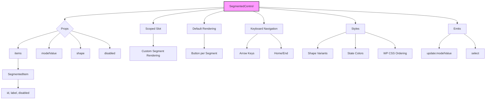

# SegmentedControl Component Implementation Plan

## Overview
Implement a Vue 3 single-file component (SFC) for a segmented control with single selection, inspired by Apple designs. The component supports two shape variants (capsule, rounded‑rectangle), individual segment disabling, and customizable content via a scoped slot. It follows the project’s functional programming patterns and uses existing design tokens.

## Component Architecture



## Functional Discipline

The component will adhere to the project’s functional programming guidelines:

- **Use existing functional utilities** (`truthy`, `existy`, `doWhen`, `when`, `unless`, `clampIndex`, `cycleIndex`, `plucker`, etc.) for conditionals, iteration, and state transitions.
- **Avoid ternary expressions in templates**; instead, compute derived values in the script block using pure functions.
- **Prefer dispatch maps** for keyboard event handling (as seen in ComboBox), leading to declarative and testable logic.
- **Composable functions** for deriving selected index, filtering disabled segments, and computing ARIA attributes.
- **Immutable updates**: treat `items` as immutable; any internal derived state (e.g., filtered enabled indices) will be computed reactively with `computed`.

### Example Patterns
- **Selection cycling**: `const nextIndex = cycleIndex(current, delta, items.length)`
- **Conditional attribute**: `:data-selected="presenceAttr(isSelected(item.id))"`
- **Keyboard handler map**: Define a plain object mapping key names to pure state transformers.

This discipline ensures the component is fluid, elegant, and maintainable, aligning with the philosophy of “Functional JavaScript” (Chapter 1‑9) that underpins the project’s utility library.

## Component Props

| Prop | Type | Default | Description |
|------|------|---------|-------------|
| items | `SegmentedItem[]` | `[]` | Array of segment objects, each with `id`, `label`, and optional `disabled`. |
| modelValue | `string | number` | `undefined` | The `id` of the currently selected segment. Supports `v‑model`. |
| shape | `'capsule' | 'rounded-rectangle'` | `'capsule'` | Border‑radius shape of the container and segments. |
| disabled | `boolean` | `false` | Whether the whole control is disabled (overrides individual disabled states). |

### Type Definitions
```typescript
type SegmentedItem = {
  id: string | number
  label: string
  disabled?: boolean
}

type SegmentedShape = 'capsule' | 'rounded-rectangle'
```

## Emits
- `update:modelValue`: emitted when the selected segment changes (used for `v‑model`).
- `select`: emitted with the selected item object when a segment is chosen.

## Slots
- **default** (scoped): provides the segment data and state for custom rendering.

Slot scope properties:
- `items`: the original `items` array.
- `selectedId`: the current selected `id` (from `modelValue`).
- `select(id)`: function to programmatically select a segment.
- `isSelected(id)`: returns `true` if the given `id` is selected.
- `isDisabled(id)`: returns `true` if the segment (or whole control) is disabled.

If the default slot is not used, the component falls back to a built‑in rendering: each segment is a `<button>` with the item’s `label`.

## Styling Details

### Shape Radii (using existing radius tokens)
- **capsule**: `border‑radius: var(--radius‑full)` (9999px) for the container and each segment.
- **rounded‑rectangle**: `border‑radius: var(--radius‑lg)` (12px) for the container; inner segments have appropriate rounding (first‑child / last‑child adjustments).

### Color Mapping
- **Selected segment**: background `var(--color‑blue)`, text `var(--color‑white)`.
- **Unselected segment**: background `var(--color‑gray5)`, text `var(--text‑primary)`.
- **Hover (unselected)**: darken background (`filter: brightness(0.95)`).
- **Active (pressed)**: further darkening (`filter: brightness(0.85)`).
- **Disabled segment**: `opacity: var(--opacity‑50)`; `cursor: not‑allowed`.

### Spacing & Dimensions
- Container: `display: inline‑flex`, `gap: 0` (segments touch each other).
- Segment buttons: `padding: var(--space‑3) var(--space‑4)`, `font‑size: var(--text‑base)`, `font‑weight: var(--font‑weight‑medium)`.
- Border: `none` for default; selected segment may have a subtle shadow.

### States
- **Whole‑control disabled**: applies `opacity: var(--opacity‑50)` and prevents all interaction.
- **Individual disabled**: prevents clicking and keyboard focus, reduces opacity.

### Responsive Scaling
- Font size already responsive via `--text‑base` token.
- Padding uses `rem` units, scaling with root font size.

### Scoped Styles
All styles will be placed inside the component’s `<style scoped>` block, following the WordPress CSS property ordering. No new global tokens will be added; existing color, spacing, and radius tokens will be used.

## Keyboard Navigation
- **ArrowLeft / ArrowUp**: move selection to the previous enabled segment (wraps).
- **ArrowRight / ArrowDown**: move selection to the next enabled segment (wraps).
- **Home**: select the first enabled segment.
- **End**: select the last enabled segment.
- **Space** / **Enter**: activate the currently focused segment (select it).

Keyboard navigation will skip disabled segments. The component will manage `aria‑selected`, `aria‑disabled`, and `tabindex` attributes for accessibility.

Implementation will use the existing functional utilities (`cycleIndex`, `clampIndex`) for index cycling and clamping.

## Implementation Steps

1. **Define component types and props**  
   Create the TypeScript type definitions and `defineProps`/`defineModel` in the `<script setup>` block.

2. **Create component directory and Vue SFC skeleton**  
   Create `src/components/segmented‑control/SegmentedControl.vue` with empty template, script, and style sections.

3. **Implement template with scoped slot and default rendering**  
   - Iterate over `items` and render either the default slot (with scope) or fallback buttons.
   - Bind `data‑selected`, `data‑disabled`, `data‑shape` attributes for CSS targeting.
   - Handle click events to update `modelValue`.

4. **Implement selection logic (click, v‑model)**  
   - When a segment is clicked (and not disabled), emit `update:modelValue` and `select`.
   - Sync `modelValue` with internal selected state.

5. **Implement keyboard navigation**  
   - Attach keydown listeners to the container.
   - Use a dispatch‑map pattern (like ComboBox) for key handlers.
   - Update focused/selected index with `cycleIndex` and `clampIndex`.

6. **Apply CSS styling with shape variants**  
   - Write SCSS rules for the container and segments.
   - Use `data‑shape` attribute to switch between capsule and rounded‑rectangle radii.
   - Implement selected, hover, active, and disabled states.

7. **Apply WordPress CSS property ordering**  
   Ensure all style blocks follow the prescribed property order (Display, Positioning, Box Model, Colors & Typography, Other).

8. **Write unit tests**  
   Create `SegmentedControl.test.ts` with test suites for:
   - Prop rendering (`shape`, `disabled`, `items`)
   - Selection behavior (click, `v‑model`)
   - Keyboard navigation
   - Disabled state handling
   - Slot rendering

9. **Integrate component into DemoPage.vue**  
   Add a new card to the demo page showcasing the SegmentedControl with various configurations.

10. **Run linting and tests validation**  
    Execute `pnpm lint` and `pnpm test:unit` to ensure code quality and correctness.

## Test Strategy
- Use `@vue/test‑utils` and `vitest`.
- Mount the component with different prop combinations.
- Simulate clicks and keyboard events.
- Assert that the correct CSS classes and data attributes are present.
- Verify that `update:modelValue` is emitted with the expected value.

## Open Questions / Decisions
- Should the selected segment have a distinct border or shadow? (Decision: use background color change only, similar to Apple’s style.)
- How to handle very long labels? (Decision: truncate with `text‑overflow: ellipsis` and `white‑space: nowrap`.)
- Should we support `icon‑only` segments? (Decision: via custom slot content; the default rendering is text‑only.)

## Next Steps
1. Review this plan with the user.
2. Switch to **Code** mode to implement the component.
3. After implementation, run tests and linting.

---
*Plan created: 2026‑01‑18*